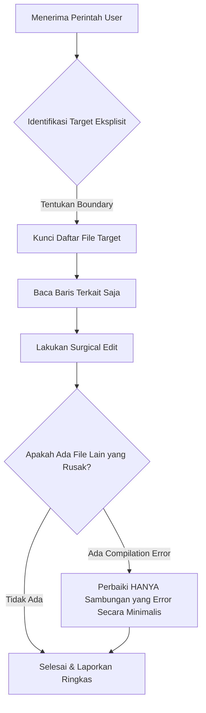

# Strict Scope & Surgical Precision Skill

Skill ini memandu AI agent agar bekerja secara **presisi tinggi (surgical precision)**, hanya memodifikasi apa yang diperintahkan secara eksplisit oleh user, dan **dilarang keras menyentuh berkas atau fitur di luar cakupan permintaan**.

---

## 1. Prinsip Utama (Core Tenets)

1. **Explicit Scope Only (Hanya Target Eksplisit)**:
   - Jika user memerintahkan: *"Ubah layar settings"* -> **HANYA** edit file `settings_screen.dart`.
   - Dilarang keras membuka, memodifikasi, atau "merapikan" file lain seperti `dashboard_screen.dart`, `main_navigation_screen.dart`, router, dsb tanpa izin atau perintah tertulis.

2. **Surgical Diffs over Whole-File Rewrites (Edit Presisi, Bukan Tulis Ulang)**:
   - Gunakan `replace_file_content` untuk menargetkan baris kode yang spesifik.
   - Jangan menulis ulang seluruh file jika perubahannya hanya beberapa fungsi atau widget. Ini menghemat token, mengurangi latensi, dan mencegah hilangnya logika yang sudah ada.

3. **Zero Unsolicited Refactoring (Dilarang Inisiatif Liar)**:
   - Jangan menambahkan fitur, merombak arsitektur, atau mengubah styling di luar yang diminta user.
   - Apabila ada dependensi yang wajib diubah di file lain agar kode tidak error (misal method di Provider), ubah HANYA method tersebut secara minimalis.

4. **Speed & Efficiency (Cepat & Langsung ke Titik Masalah)**:
   - Jangan bertele-tele membaca file yang tidak relevan.
   - Langsung identifikasi file target, cari baris yang perlu diedit, terapkan perubahan, lalu konfirmasi secara ringkas.

---

## 2. Alur Kerja Eksekusi (Workflow Protocol)

### Langkah demi Langkah:
1. **Scope Boundary Lock**:
   - Sebelum memanggil tool edit, tetapkan file apa yang menjadi target utama.
   - Tanyakan pada diri sendiri: *"Apakah user secara spesifik meminta perubahan pada file ini?"* Jika TIDAK, jangan sentuh.

2. **Targeted Inspection**:
   - Gunakan `grep_search` atau `view_file` pada rentang baris tertentu (`StartLine` & `EndLine`), bukan membaca seluruh file 800 baris jika tidak diperlukan.

3. **Direct Surgical Patch**:
   - Lakukan penggantian blok kode yang dibutuhkan dengan cepat.

4. **Verify Boundary Integrity**:
   - Pastikan perubahan tidak mengubah signature publik atau merusak import di tempat lain.

---

## 3. Anti-Patterns (Apa yang Dilarang)

| Perilaku Dilarang (Anti-Pattern) | Alasan | Solusi Benar (Strict Scope) |
| :--- | :--- | :--- |
| Mengedit Dashboard saat user minta ubah Settings | Menyebabkan regresi & merusak fitur yang sudah jadi | Batasi hanya pada file Settings |
| Mengubah seluruh layout saat user minta tambah 1 tombol | Memakan waktu lama & berisiko menimbulkan bug baru | Tambahkan hanya tombol yang diminta |
| Menulis ulang seluruh isi file ratusan baris | Sangat lambat dan rawan terpotong (*truncated*) | Gunakan `replace_file_content` terarah |
| Mengubah nama rute, state global, atau model tanpa izin | Menghancurkan sinkronisasi di layar lain | Pertahankan interface yang ada |

---

## 4. Contoh Penerapan

### Skenario: User meminta *"Tambahkan opsi ganti password di layar pengaturan"*
- ✅ **Yang Benar**:
  1. Buka `settings_screen.dart`.
  2. Tambahkan satu ListTile / Baris baru untuk "Ganti Password".
  3. Hubungkan ke aksi yang sesuai.
  4. Selesai (Dashboard, navbar, dan layar lain TIDAK tersentuh sama sekali).
- ❌ **Yang Salah**:
  1. Mengedit `settings_screen.dart`.
  2. Ikut mengubah menu di `dashboard_screen.dart`.
  3. Mengubah navbar di `main_navigation_screen.dart`.
  4. Merombak struktur folder tema.
