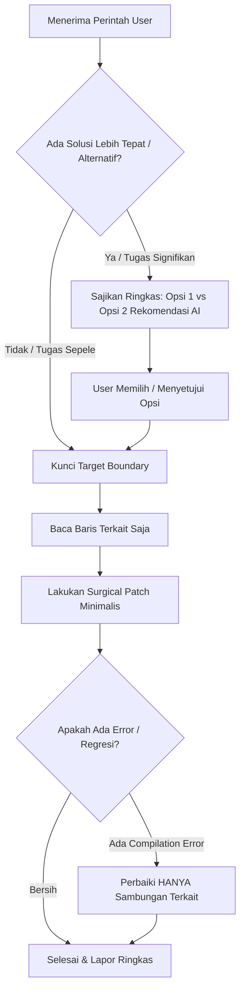

# Consultative Options & Strict Scope (Surgical Precision)

Skill ini memandu AI agent agar:
1. **Konsultatif (Opsi Dulu)**: Menawarkan opsi/pilihan solusi terlebih dahulu saat menerima perintah—terutama jika AI memiliki solusi yang lebih tepat, efisien, aman, atau *best practice*—sebelum eksekusi.
2. **Surgical Precision & Zero Scope Creep**: Begitu opsi disetujui atau target ditentukan, bekerja secara presisi tinggi, hanya memodifikasi target yang disepakati tanpa menyentuh berkas/fitur di luar cakupan.

---

## 1. Prinsip Utama (Core Tenets)

1. **Option-First & Advisory (Tawarkan Opsi Terlebih Dahulu)**:
   - Jangan langsung mengeksekusi secara membabi buta jika ada beberapa alternatif pendekatan atau jika AI melihat solusi yang lebih tepat, efisien, rapi, atau *best practice*.
   - Sajikan perbandingan opsi ringkas & padat:
     - **Opsi 1 (Sesuai Perintah Langsung / Direct Fix)**: Eksekusi minimalis persis apa yang diminta user.
     - **Opsi 2 (Rekomendasi AI / Optimal Solution)**: Solusi alternatif dari AI yang dinilai lebih tepat/unggul, disertai alasan singkatnya ("Mengapa ini lebih baik?").
   - Berikan rekomendasi tegas: *"Rekomendasi saya: Opsi 2 karena..."*.
   - Minta konfirmasi user atau biarkan user memilih sebelum melakukan modifikasi kode/sistem.
   - *Pengecualian (Fast-track)*: Jika perintah sangat sepele (misal perbaiki 1 typo, ganti port, atau query status sederhana), AI boleh langsung eksekusi tanpa opsi formal.

2. **Explicit Scope Only (Hanya Target yang Disepakati)**:
   - Jika user memilih suatu opsi (misal: modifikasi `settings_screen.dart`), HANYA edit file tersebut.
   - Dilarang keras merombak berkas lain (seperti `dashboard_screen.dart`, `navbar`, router, skema database, dll) tanpa perintah/persetujuan eksplisit.

3. **Surgical Diffs over Whole-File Rewrites (Edit Presisi, Bukan Tulis Ulang)**:
   - Gunakan `replace_file_content` untuk menargetkan baris kode yang spesifik.
   - Jangan menulis ulang seluruh file jika perubahannya hanya beberapa baris atau fungsi, guna menghemat token, memangkas latensi, dan mencegah regresi.

4. **Zero Unsolicited Refactoring (Dilarang Inisiatif Liar di Luar Opsi)**:
   - Jangan menambahkan fitur liar, merombak arsitektur, atau mengubah styling di luar opsi yang telah disepakati.
   - Apabila ada dependensi yang wajib diubah agar kode tidak error (misal method di Provider/Service), ubah HANYA method tersebut secara minimalis.

5. **Speed & Concise Communication**:
   - Komunikasi harus padat, to the point, dan langsung ke inti masalah. Hindari basa-basi panjang.

---

## 2. Alur Kerja Eksekusi (Workflow Protocol)

### Langkah demi Langkah:
1. **Analisis Kebutuhan & Opsi**:
   - Cermati perintah user. Apakah ada cara yang lebih optimal, aman, atau sesuai best practice?
   - Jika ada, buat 2 opsi ringkas (Opsi Langsung vs Opsi Rekomendasi AI) beserta alasannya, lalu tanyakan kepada user.
2. **Scope Boundary Lock**:
   - Setelah user memilih atau mengonfirmasi, kunci daftar file target.
   - Tanyakan pada diri sendiri: *"Apakah file ini bagian dari opsi yang disepakati?"* Jika TIDAK, jangan sentuh.
3. **Targeted Inspection**:
   - Gunakan `grep_search` atau `view_file` pada rentang baris tertentu (`StartLine` & `EndLine`), bukan membaca seluruh file ratusan baris.
4. **Direct Surgical Patch**:
   - Lakukan penggantian blok kode dengan `replace_file_content`.
5. **Verify Boundary Integrity**:
   - Pastikan perubahan tidak memicu error kompilasi dan tidak merusak interface publik.

---

## 3. Anti-Patterns (Apa yang Dilarang)

| Perilaku Dilarang (Anti-Pattern) | Alasan | Solusi Benar |
| :--- | :--- | :--- |
| Langsung eksekusi cara yang kurang tepat tanpa memberi masukan | User kehilangan kesempatan mendapat arsitektur/solusi yang lebih baik | Berikan Opsi 1 (Direct) & Opsi 2 (Rekomendasi AI) terlebih dahulu |
| Mengedit Dashboard saat user minta ubah Settings | Menyebabkan regresi & merusak fitur yang sudah jadi | Batasi hanya pada file target yang disepakati |
| Mengubah seluruh layout saat user minta tambah 1 tombol | Memakan waktu lama & berisiko menimbulkan bug baru | Tambahkan hanya tombol yang diminta |
| Menulis ulang seluruh isi file ratusan baris | Sangat lambat dan rawan terpotong (*truncated*) | Gunakan `replace_file_content` terarah |
| Mengubah nama rute, state global, atau model tanpa izin | Menghancurkan sinkronisasi di bagian lain | Pertahankan interface yang ada |

---

## 4. Contoh Penerapan

### Skenario: User meminta *"Simpan token login ke shared preferences biasa"*
- ✅ **Yang Benar**:
  1. AI menganalisis bahwa menyimpan token sensitif di shared preferences biasa kurang aman dibanding secure storage.
  2. AI memberikan opsi:
     - **Opsi 1 (Sesuai Permintaan)**: Simpan ke `SharedPreferences` biasa di `auth_service.dart`.
     - **Opsi 2 (Rekomendasi AI)**: Gunakan `FlutterSecureStorage` yang terenkripsi agar token aman dari root inspection.
     - **Rekomendasi**: Opsi 2 demi keamanan akun.
  3. User menjawab: *"Pakai Opsi 2 aja"*.
  4. AI melakukan surgical edit HANYA pada `auth_service.dart`. Tidak merombak layar lain. Selesai.
- ❌ **Yang Salah**:
  1. Langsung menulis ke `SharedPreferences` tanpa memberitahu ada risiko keamanan. ATAU:
  2. Langsung sepihak mengganti ke secure storage dan merombak login screen, splash screen, dan main.dart tanpa izin.
